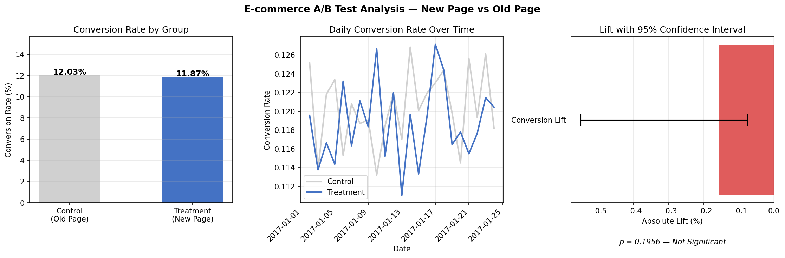
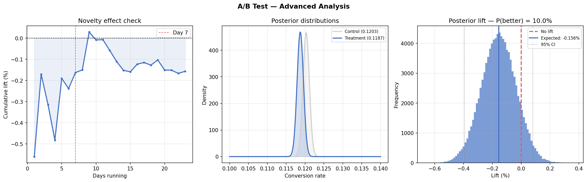

# E-Commerce A/B Test Analysis

<p align="center">
  
  
  
  
  
</p>

> Evaluated a new landing page across **288K clean user sessions**
> using both frequentist and Bayesian methods — both converged on
> the same conclusion: **do not launch**.
> The new page shows no meaningful conversion improvement and
> carries a projected **$142K annual downside** at current traffic.

---

## Results





---

## Decision: Do Not Launch

Both frequentist and Bayesian analyses agree — the new page
does not improve conversions.

| Metric | Value |
|---|---|
| Control conversion rate | 12.03% |
| Treatment conversion rate | 11.87% |
| Absolute lift | -0.16% |
| P-value (z-test) | 0.196 |
| P(treatment better) — Bayesian | 10.0% |
| 95% Credible interval | [-0.39%, +0.08%] |
| Novelty effect detected | No |
| Projected annual impact | **-$142,638** |
| **Recommendation** | **Do not launch** |

---

## Why Both Methods?

Most A/B analyses stop at a p-value. This one doesn't.

| Approach | What It Answers |
|---|---|
| Frequentist z-test | Is the observed difference statistically significant? |
| Bayesian analysis | What is the probability treatment is actually better? |

Frequentist testing gives a binary significant/not-significant
answer but doesn't quantify *how likely* treatment is to be
better. Bayesian testing gives a direct probability — here,
**10%** — which is more actionable for business decisions.

Both methods agree here, which makes the recommendation
unusually robust.

---

## Key Findings

**Frequentist test:**
- p-value of 0.196 — no significant difference at α = 0.05
- The observed -0.16% drop sits well within random variation
- Test was fully powered — 144K users per group vs 16,611
  required — ruling out underpowering as an explanation

**Bayesian analysis:**
- Only 10% probability that treatment outperforms control
- Expected lift of -0.156% — the model puts most weight on
  the new page performing worse
- 95% credible interval spans mostly negative territory
  [-0.39%, +0.08%]

**Novelty effect check:**
- First 7 days avg lift: -0.30% — already negative from day one
- After 7 days avg lift: -0.11% — slight recovery, still negative
- No novelty effect — the new page never showed early promise
  that faded; it was flat-to-negative throughout

**Data quality:**
- Removed 3,894 duplicate user sessions — kept first visit per user
- Removed 3,893 mismatched rows — users shown wrong page for
  their assigned group
- Final clean dataset: **288,540 sessions** across two
  balanced groups

---

## Business Impact

Assumptions: 10,000 daily visitors · $25 revenue per conversion

| Scenario | Daily Impact | Annual Impact |
|---|---|---|
| Launch new page | -$391 / day | -$142,638 / year |
| Keep old page | $0 | $0 |

The right call: keep the old page and redirect engineering
effort elsewhere.

---

## Methodology

**Data cleaning:**
- Deduplicated on `user_id` — 3,894 duplicate sessions removed
- Removed 3,893 mismatched rows where group assignment and
  page shown were inconsistent

**Frequentist test:**
- Two-sample z-test for difference in proportions
- H₀: conversion rate (treatment) = conversion rate (control)
- H₁: conversion rate (treatment) ≠ conversion rate (control)
- α = 0.05, two-tailed

**Bayesian test:**
- Uninformative Beta(1,1) prior on both groups
- Updated to Beta(α, β) using observed conversions
- 100,000 Monte Carlo samples drawn from each posterior
- P(treatment > control) computed directly from samples

**Novelty effect check:**
- Cumulative conversion rates computed daily for both groups
- Average lift compared: first 7 days vs remainder

**Power analysis:**
- MDE set at 1% absolute lift
- Required n = 16,611 per group
- Actual n = 144,226 per group — test fully powered

---

## Stack

| Layer | Tools |
|---|---|
| Frequentist testing | SciPy — z-test, power analysis |
| Bayesian testing | NumPy, SciPy — Beta distribution, Monte Carlo |
| Effect size | Cohen's h |
| Data cleaning | Pandas |
| Visualization | Matplotlib |
| Language | Python 3.9+ |

---

## Project Structure

```
ab_test_analysis/
├── src/
│   ├── analysis.py           # Frequentist z-test, power analysis,
│   │                         # business impact
│   └── further_analysis.py   # Novelty effect, Bayesian analysis
├── data/
│   └── ab_data.csv           # Raw experiment data (294K sessions)
├── reports/
│   ├── ab_test_results.png   # Conversion rates, daily trend, lift CI
│   └── advanced_analysis.png # Novelty effect, posteriors, lift histogram
├── requirements.txt
└── README.md
```

---

## Run Locally

```bash
git clone https://github.com/pulipakav1/ab_test.git
cd ab_test

pip install pandas numpy scipy matplotlib

python src/analysis.py
python src/further_analysis.py
```

---

## License

MIT — use and modify freely.

---

